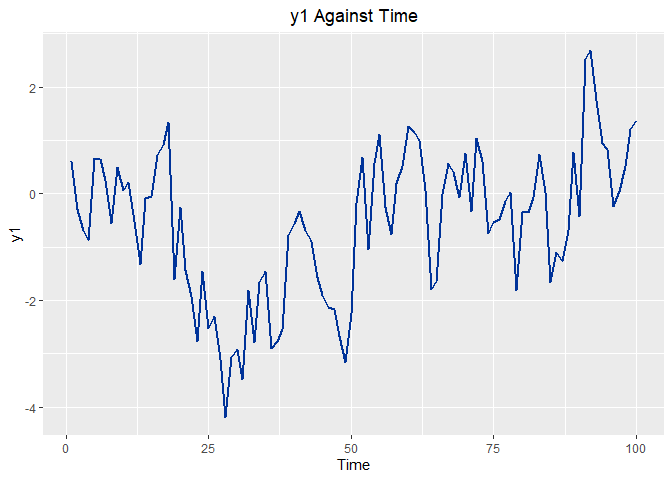
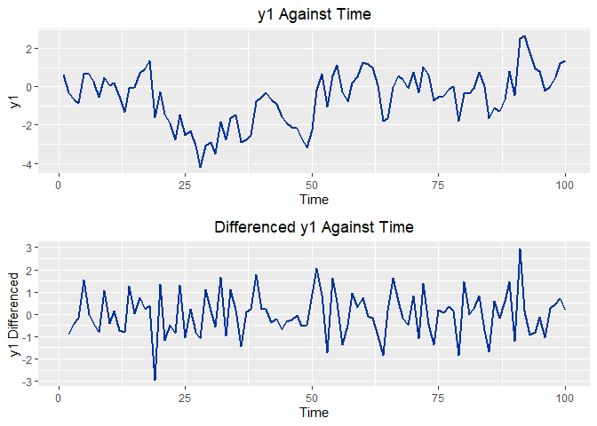
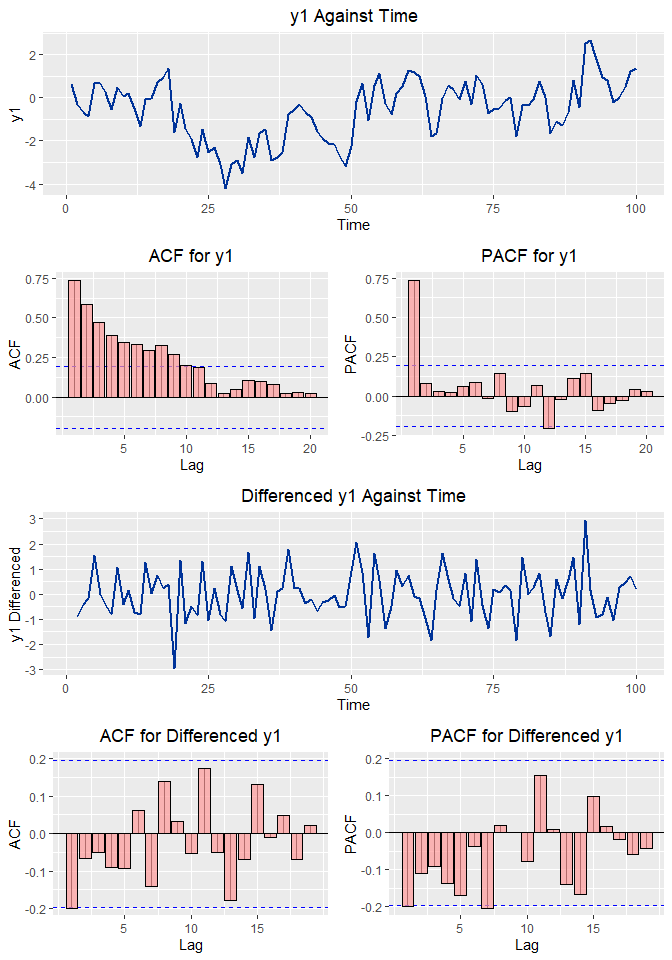
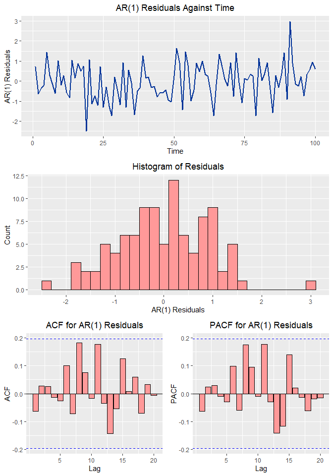

Exploratory Time Series Analysis with Fictional Data
================
William Brasic
3/4/2021

### Clear Environment and Console

``` r
rm(list=ls())
cat("\014")
```

### Set Working Directory

``` r
setwd("C:/Users/wbras/OneDrive/Desktop/GitHub/Time_Series_Fictional_Data_R")
```

<p>

 

</p>

## Data Preliminaries

<p>

 

</p>

### Load Necessary Packages

``` r
if (!require(tidyverse)) install.packages(c('tidyverse',
                                            'tsibble',
                                            'gridExtra',
                                            'feasts',
                                            'pacman'))

pacman::p_load(tidyverse, tsibble)
```

<p>

 

</p>

### Load Dataset

``` r
df <- read_csv('SIM_2.csv')[-3:-4]
```

<p>

 

</p>

### Convert Data to Time Series Dataframe

``` r
df <- tsibble(Time = 1:100, y1 = df$Y1, index = 'Time')
```

<p>

 

</p>

### Plot y1 over Time

``` r
plot.y1.time <- df %>%
  ggplot() + 
  geom_line(aes(x = Time, y = y1), color = '#003399', size = 1) + 
  ggtitle('y1 Against Time') + 
  theme(plot.title = element_text(hjust = 0.5)) +
  xlab('Time') + 
  ylab('y1')
plot.y1.time
```

<!-- -->

``` r
# Looks fairly stationary; possibly not though. Check ACF and PACF for further evidence.
```

<p>

 

</p>

``` r
mean(df$y1[25:50]) 
```

    ## [1] -2.179307

``` r
# mean is -2.17 for 25% of data. 
```

``` r
(mean(df$y1[1:24]) + mean(df$y1[51:100]))/2 
```

    ## [1] -0.08946222

``` r
# mean is very close to 0 for other part of data
```

<p>

 

</p>

### Differencing y1

``` r
df <- df %>%
  mutate(y1.d1 = difference(y1,1))

plot.y1.d1.time <- df %>%
  ggplot() + 
  geom_line(aes(x = Time, y = y1.d1), color = '#003399', size = 1) + 
  ggtitle('Differenced y1 Against Time') + 
  theme(plot.title = element_text(hjust = 0.5)) +
  xlab('Time') + 
  ylab('y1 Differenced')
```

<p>

 

</p>

### Putting y1 and y1.d1 Into One Picture

``` r
gridExtra::grid.arrange(plot.y1.time, plot.y1.d1.time, ncol=1) 
```

<!-- -->

``` r
# Looks like differencing made the series look like white noise
```

<p>

 

</p>

## Plotting Empirical ACFs and PACFs

<p>

 

</p>

### Empirical ACF for y1

``` r
plot.y1.acf <- df %>%
  feasts::ACF(y1) %>%
  autoplot() +
  geom_bar(stat = 'identity', 
           fill = "#FF9999",
           color = 'black',
           alpha = 0.7) +
  ggtitle('ACF for y1') + 
  theme(plot.title = element_text(hjust = 0.5)) +
  xlab('Lag') + 
  ylab('ACF')
```

<p>

 

</p>

### Empirical PACF for y1

``` r
plot.y1.pacf <- df %>%
  feasts::ACF(y1, type = 'partial') %>%
  autoplot() +
  geom_bar(stat = 'identity', 
           fill = "#FF9999",
           color = 'black',
           alpha = 0.7) +
  ggtitle('PACF for y1') + 
  theme(plot.title = element_text(hjust = 0.5)) +
  xlab('Lag') + 
  ylab('PACF')
```

<p>

 

</p>

### Empirical ACF for Differenced y1

``` r
plot.y1.d1.acf <- df %>%
  feasts::ACF(y1.d1) %>%
  autoplot() +
  geom_bar(stat = 'identity', 
           fill = "#FF9999",
           color = 'black',
           alpha = 0.7) +
  ggtitle('ACF for Differenced y1') + 
  theme(plot.title = element_text(hjust = 0.5)) +
  xlab('Lag') + 
  ylab('ACF')
```

<p>

 

</p>

### Empirical PACF for Differenced y1

``` r
plot.y1.d1.pacf <- df %>%
  feasts::ACF(y1.d1, type = 'partial') %>%
  autoplot() +
  geom_bar(stat = 'identity', 
           fill = "#FF9999",
           color = 'black',
           alpha = 0.7) +
  ggtitle('PACF for Differenced y1') + 
  theme(plot.title = element_text(hjust = 0.5)) +
  xlab('Lag') + 
  ylab('PACF')
```

<p>

 

</p>

### Putting ACF and PACF Plot for y1 into One Picture

``` r
plot.y1.acf.pacf <- gridExtra::grid.arrange(plot.y1.acf, plot.y1.pacf, nrow=1)
```

<p>

 

</p>

### Putting ACF and PACF Plot for Differenced y1 into One Picture

``` r
plot.y1.d1.acf.pacf <- gridExtra::grid.arrange(plot.y1.d1.acf, plot.y1.d1.pacf, nrow=1)
```

<p>

 

</p>

### All Pictures Together

``` r
gridExtra::grid.arrange(plot.y1.time, plot.y1.acf.pacf,
                        plot.y1.d1.time, plot.y1.d1.acf.pacf, nrow=4)
```

<!-- -->

``` r
# Looks like differencing the data did make it white noise.
# Based on the non-differenced ACF we definitely have an AR process. Looking then at the PACF we should have an AR(1)
```

<p>

 

</p>

## Model Estimation

### Load Necessary Packages

``` r
if (!require(fable)) install.packages('fable')
if (!require(fabletools)) install.packages('fabletools')
if (!require(tseries)) install.packages('tseries')
if (!require(car)) install.packages('car')


pacman::p_load(fable, fabletools)
```

<p>

 

</p>

### AR(1) w/ Intercept

``` r
y1.AR1 <- df %>%
  model(ARIMA(y1 ~ 1+ pdq(1,0,0) + PDQ(0,0,0)))
report(y1.AR1)
```

    ## Series: y1 
    ## Model: ARIMA(1,0,0) w/ mean 
    ## 
    ## Coefficients:
    ##          ar1  constant
    ##       0.7526   -0.1190
    ## s.e.  0.0658    0.0893
    ## 
    ## sigma^2 estimated as 0.8579:  log likelihood=-133.64
    ## AIC=273.28   AICc=273.53   BIC=281.09

``` r
coef(y1.AR1)
```

    ## # A tibble: 2 x 6
    ##   .model                           term    estimate std.error statistic  p.value
    ##   <chr>                            <chr>      <dbl>     <dbl>     <dbl>    <dbl>
    ## 1 ARIMA(y1 ~ 1 + pdq(1, 0, 0) + P~ ar1        0.753    0.0658     11.4  7.30e-20
    ## 2 ARIMA(y1 ~ 1 + pdq(1, 0, 0) + P~ consta~   -0.119    0.0893     -1.33 1.86e- 1

<p>

 

</p>

### AR(2) w/ Intercept

``` r
y1.AR2 <- df %>%
  model(ARIMA(y1 ~ 1+ pdq(2,0,0) + PDQ(0,0,0)))
report(y1.AR2)
```

    ## Series: y1 
    ## Model: ARIMA(2,0,0) w/ mean 
    ## 
    ## Coefficients:
    ##          ar1     ar2  constant
    ##       0.6877  0.0867   -0.1045
    ## s.e.  0.0995  0.1002    0.0886
    ## 
    ## sigma^2 estimated as 0.8602:  log likelihood=-133.27
    ## AIC=274.53   AICc=274.95   BIC=284.95

``` r
coef(y1.AR2)
```

    ## # A tibble: 3 x 6
    ##   .model                           term    estimate std.error statistic  p.value
    ##   <chr>                            <chr>      <dbl>     <dbl>     <dbl>    <dbl>
    ## 1 ARIMA(y1 ~ 1 + pdq(2, 0, 0) + P~ ar1       0.688     0.0995     6.91  4.57e-10
    ## 2 ARIMA(y1 ~ 1 + pdq(2, 0, 0) + P~ ar2       0.0867    0.100      0.865 3.89e- 1
    ## 3 ARIMA(y1 ~ 1 + pdq(2, 0, 0) + P~ consta~  -0.105     0.0886    -1.18  2.41e- 1

<p>

 

</p>

### ARMA(1,1) w/ Intercept

``` r
y1.ARMA11 <- df %>%
  model(ARIMA(y1 ~ 1+ pdq(1,0,1) + PDQ(0,0,0)))
report(y1.ARMA11)
```

    ## Series: y1 
    ## Model: ARIMA(1,0,1) w/ mean 
    ## 
    ## Coefficients:
    ##          ar1      ma1  constant
    ##       0.8053  -0.1220   -0.0896
    ## s.e.  0.0797   0.1367    0.0777
    ## 
    ## sigma^2 estimated as 0.8598:  log likelihood=-133.24
    ## AIC=274.49   AICc=274.91   BIC=284.91

``` r
coef(y1.ARMA11)
```

    ## # A tibble: 3 x 6
    ##   .model                           term    estimate std.error statistic  p.value
    ##   <chr>                            <chr>      <dbl>     <dbl>     <dbl>    <dbl>
    ## 1 ARIMA(y1 ~ 1 + pdq(1, 0, 1) + P~ ar1       0.805     0.0797    10.1   6.03e-17
    ## 2 ARIMA(y1 ~ 1 + pdq(1, 0, 1) + P~ ma1      -0.122     0.137     -0.893 3.74e- 1
    ## 3 ARIMA(y1 ~ 1 + pdq(1, 0, 1) + P~ consta~  -0.0896    0.0777    -1.15  2.51e- 1

<p>

 

</p>

### ARMA (2,1) w/ Intercept

``` r
y1.ARMA21 <- df %>%
  model(ARIMA(y1 ~ 1+ pdq(2,0,1) + PDQ(0,0,0)))
report(y1.ARMA21)
```

    ## Series: y1 
    ## Model: ARIMA(2,0,1) w/ mean 
    ## 
    ## Coefficients:
    ##          ar1      ar2      ma1  constant
    ##       1.4600  -0.4973  -0.7793   -0.0143
    ## s.e.  0.2439   0.2047   0.2071    0.0192
    ## 
    ## sigma^2 estimated as 0.8614:  log likelihood=-132.84
    ## AIC=275.68   AICc=276.32   BIC=288.71

``` r
coef(y1.ARMA21)
```

    ## # A tibble: 4 x 6
    ##   .model                         term    estimate std.error statistic    p.value
    ##   <chr>                          <chr>      <dbl>     <dbl>     <dbl>      <dbl>
    ## 1 ARIMA(y1 ~ 1 + pdq(2, 0, 1) +~ ar1       1.46      0.244      5.99     3.39e-8
    ## 2 ARIMA(y1 ~ 1 + pdq(2, 0, 1) +~ ar2      -0.497     0.205     -2.43     1.69e-2
    ## 3 ARIMA(y1 ~ 1 + pdq(2, 0, 1) +~ ma1      -0.779     0.207     -3.76     2.83e-4
    ## 4 ARIMA(y1 ~ 1 + pdq(2, 0, 1) +~ consta~  -0.0143    0.0192    -0.745    4.58e-1

<p>

 

</p>

### AR(2) no intercept

``` r
y1.AR2.interceptless <- df %>%
  model(ARIMA(y1 ~ pdq(2,0,0) + PDQ(0,0,0)))
report(y1.AR2.interceptless)
```

    ## Series: y1 
    ## Model: ARIMA(2,0,0) 
    ## 
    ## Coefficients:
    ##          ar1     ar2
    ##       0.7016  0.1039
    ## s.e.  0.0991  0.0993
    ## 
    ## sigma^2 estimated as 0.8603:  log likelihood=-133.85
    ## AIC=273.69   AICc=273.94   BIC=281.51

``` r
coef(y1.AR2.interceptless)
```

    ## # A tibble: 2 x 6
    ##   .model                             term  estimate std.error statistic  p.value
    ##   <chr>                              <chr>    <dbl>     <dbl>     <dbl>    <dbl>
    ## 1 ARIMA(y1 ~ pdq(2, 0, 0) + PDQ(0, ~ ar1      0.702    0.0991      7.08 2.04e-10
    ## 2 ARIMA(y1 ~ pdq(2, 0, 0) + PDQ(0, ~ ar2      0.104    0.0993      1.05 2.98e- 1

<p>

 

</p>

### ARMA(1,1) no intercept

``` r
y1.ARMA11.interceptless <- df %>%
  model(ARIMA(y1 ~ pdq(1,0,1) + PDQ(0,0,0)))
report(y1.ARMA11.interceptless)
```

    ## Series: y1 
    ## Model: ARIMA(1,0,1) 
    ## 
    ## Coefficients:
    ##          ar1      ma1
    ##       0.8384  -0.1463
    ## s.e.  0.0686   0.1333
    ## 
    ## sigma^2 estimated as 0.8594:  log likelihood=-133.79
    ## AIC=273.59   AICc=273.84   BIC=281.4

``` r
coef(y1.ARMA11.interceptless)
```

    ## # A tibble: 2 x 6
    ##   .model                             term  estimate std.error statistic  p.value
    ##   <chr>                              <chr>    <dbl>     <dbl>     <dbl>    <dbl>
    ## 1 ARIMA(y1 ~ pdq(1, 0, 1) + PDQ(0, ~ ar1      0.838    0.0686     12.2  1.46e-21
    ## 2 ARIMA(y1 ~ pdq(1, 0, 1) + PDQ(0, ~ ma1     -0.146    0.133      -1.10 2.75e- 1

#### Based on information criteria methods the AR(1) model has best fit

<p>

 

</p>

## Visual Residual Inspection

### First Few Residuals

``` r
head(residuals(y1.AR1), n = 10)
```

    ## # A tsibble: 10 x 3 [1]
    ## # Key:       .model [1]
    ##    .model                                       Time .resid
    ##    <chr>                                       <int>  <dbl>
    ##  1 ARIMA(y1 ~ 1 + pdq(1, 0, 0) + PDQ(0, 0, 0))     1  0.717
    ##  2 ARIMA(y1 ~ 1 + pdq(1, 0, 0) + PDQ(0, 0, 0))     2 -0.632
    ##  3 ARIMA(y1 ~ 1 + pdq(1, 0, 0) + PDQ(0, 0, 0))     3 -0.348
    ##  4 ARIMA(y1 ~ 1 + pdq(1, 0, 0) + PDQ(0, 0, 0))     4 -0.229
    ##  5 ARIMA(y1 ~ 1 + pdq(1, 0, 0) + PDQ(0, 0, 0))     5  1.44 
    ##  6 ARIMA(y1 ~ 1 + pdq(1, 0, 0) + PDQ(0, 0, 0))     6  0.267
    ##  7 ARIMA(y1 ~ 1 + pdq(1, 0, 0) + PDQ(0, 0, 0))     7 -0.119
    ##  8 ARIMA(y1 ~ 1 + pdq(1, 0, 0) + PDQ(0, 0, 0))     8 -0.625
    ##  9 ARIMA(y1 ~ 1 + pdq(1, 0, 0) + PDQ(0, 0, 0))     9  1.03 
    ## 10 ARIMA(y1 ~ 1 + pdq(1, 0, 0) + PDQ(0, 0, 0))    10 -0.180

<p>

 

</p>

### Histogram of Residuals

``` r
plot.y1.AR1.hist.residuals <- residuals(y1.AR1) %>%
  ggplot(aes(x = .resid)) + 
  geom_histogram(binwidth=0.2, color="black", fill="#FF9999") + 
  ggtitle('Histogram of Residuals') + 
  theme(plot.title = element_text(hjust = 0.5)) +
  xlab('AR(1) Residuals') + 
  ylab('Count')
```

<p>

 

</p>

### Residuals Over Time

``` r
plot.y1.AR1.residuals.time <- residuals(y1.AR1) %>%
  ggplot() + 
  geom_line(aes(x = Time, y = .resid), color = '#003399', size = 1) + 
  ggtitle('AR(1) Residuals Against Time') + 
  theme(plot.title = element_text(hjust = 0.5)) +
  xlab('Time') + 
  ylab('AR(1) Residuals')
```

<p>

 

</p>

### Empirical ACF for AR(1) Residuals

``` r
plot.y1.AR1.residuals.acf <- residuals(y1.AR1) %>%
  feasts::ACF(.resid) %>%
  autoplot() +
  geom_bar(stat = 'identity', 
           fill = "#FF9999",
           color = 'black') +
  ggtitle('ACF for AR(1) Residuals') + 
  theme(plot.title = element_text(hjust = 0.5)) +
  xlab('Lag') + 
  ylab('ACF')
```

<p>

 

</p>

### Empirical PACF for AR(1) Residuals

``` r
plot.y1.AR1.residuals.pacf <- residuals(y1.AR1) %>%
  feasts::ACF(.resid, type = 'partial') %>%
  autoplot() +
  geom_bar(stat = 'identity', 
           fill = "#FF9999",
           color = 'black') +
  ggtitle('PACF for AR(1) Residuals') + 
  theme(plot.title = element_text(hjust = 0.5)) +
  xlab('Lag') + 
  ylab('PACF')
```

<p>

 

</p>

### EACF and EPACF Together

``` r
plot.y1.AR1.residuals.acf.pacf <- gridExtra::grid.arrange(plot.y1.AR1.residuals.acf, 
                                                          plot.y1.AR1.residuals.pacf, 
                                                          nrow=1)
```

<p>

 

</p>

### Various Residual Plots Together

``` r
gridExtra::grid.arrange(plot.y1.AR1.residuals.time, 
                        plot.y1.AR1.hist.residuals,
                        plot.y1.AR1.residuals.acf.pacf, 
                        nrow=3) 
```

<!-- -->

``` r
# Residuals appear to be white noise
```

<p>

 

</p>

## Testing for Residual White Noise, i.e., Normality and Zero Autocorrelation

<p>

 

</p>

### Ljung-Box Test for Autocorrelation for Lag = 8

``` r
residuals(y1.AR1) %>% 
  features(.resid, feasts::ljung_box, lag = 8, dof = 2)
```

    ## # A tibble: 1 x 3
    ##   .model                                      lb_stat lb_pvalue
    ##   <chr>                                         <dbl>     <dbl>
    ## 1 ARIMA(y1 ~ 1 + pdq(1, 0, 0) + PDQ(0, 0, 0))    6.04     0.419

``` r
# High p-value. Hence, fail to reject null of zero residual autocorrelation
```

<p>

 

</p>

### Ljung-Box Test for Autocorrelation for Lag = 16

``` r
residuals(y1.AR1) %>% 
  features(.resid, feasts::ljung_box, lag = 16, dof = 2)
```

    ## # A tibble: 1 x 3
    ##   .model                                      lb_stat lb_pvalue
    ##   <chr>                                         <dbl>     <dbl>
    ## 1 ARIMA(y1 ~ 1 + pdq(1, 0, 0) + PDQ(0, 0, 0))    15.1     0.374

``` r
# High p-value. Hence, fail to reject null of zero residual autocorrelation
```

<p>

 

</p>

### Ljung-Box Test for Autocorrelation for Lag = 24

``` r
residuals(y1.AR1) %>% 
  features(.resid, feasts::ljung_box, lag = 24, dof = 2)
```

    ## # A tibble: 1 x 3
    ##   .model                                      lb_stat lb_pvalue
    ##   <chr>                                         <dbl>     <dbl>
    ## 1 ARIMA(y1 ~ 1 + pdq(1, 0, 0) + PDQ(0, 0, 0))    20.9     0.524

``` r
# High p-value. Hence, fail to reject null of zero residual autocorrelation
```

<p>

 

</p>

### Durbin-Watson Test for Autocorrelation. Applicable Since AR(1)

``` r
residuals(y1.AR1) %>% 
  features(.resid, car::durbinWatsonTest,  alternative = c("two.sided")) 
```

    ## New names:
    ## * `` -> ...1

    ## # A tibble: 1 x 2
    ##   .model                                       ...1
    ##   <chr>                                       <dbl>
    ## 1 ARIMA(y1 ~ 1 + pdq(1, 0, 0) + PDQ(0, 0, 0))  2.12

``` r
# Test statistic close to 2 as expected. Hence, fail to reject null of zero residual autocorrelation
```

<p>

 

</p>

### Jarque-Bera Test for Normality

``` r
tseries::jarque.bera.test(residuals(y1.AR1)$.resid)
```

    ## 
    ##  Jarque Bera Test
    ## 
    ## data:  residuals(y1.AR1)$.resid
    ## X-squared = 0.17249, df = 2, p-value = 0.9174

``` r
# High p-value. Hence, fail to reject null of normality
```
